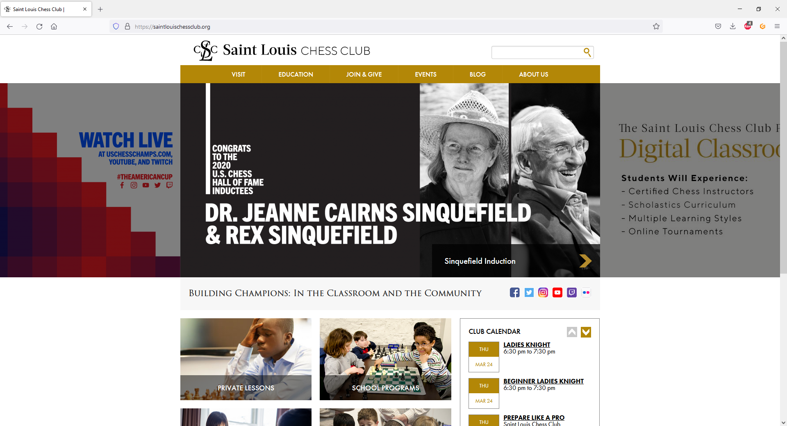
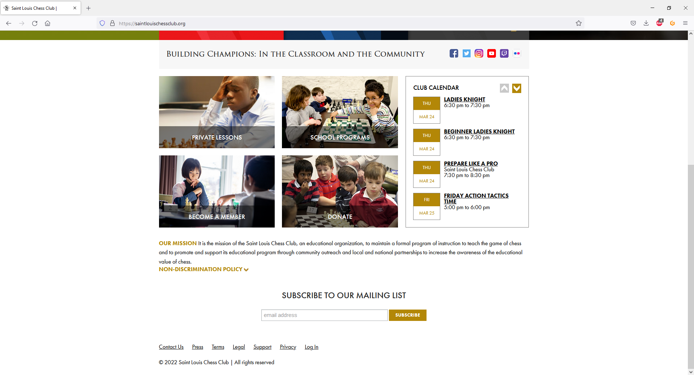
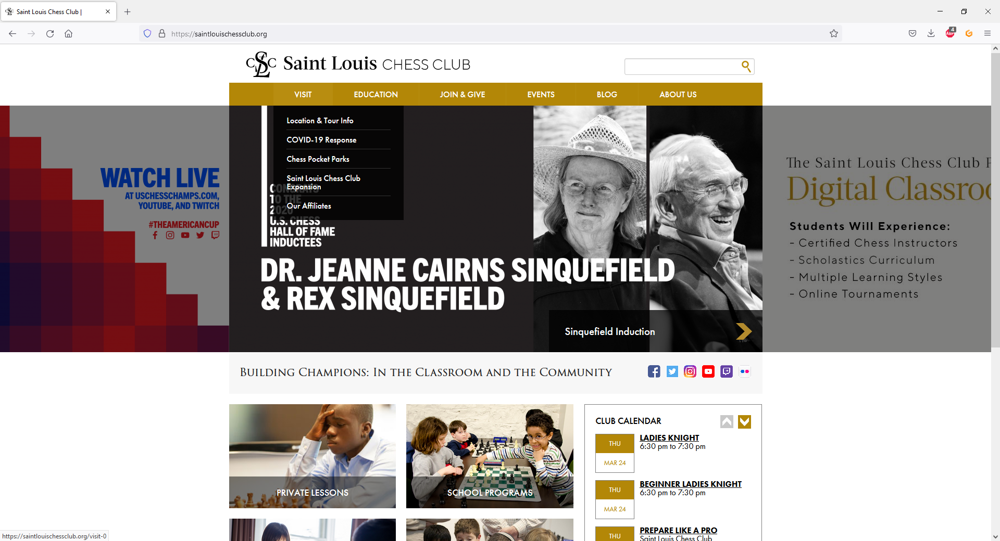
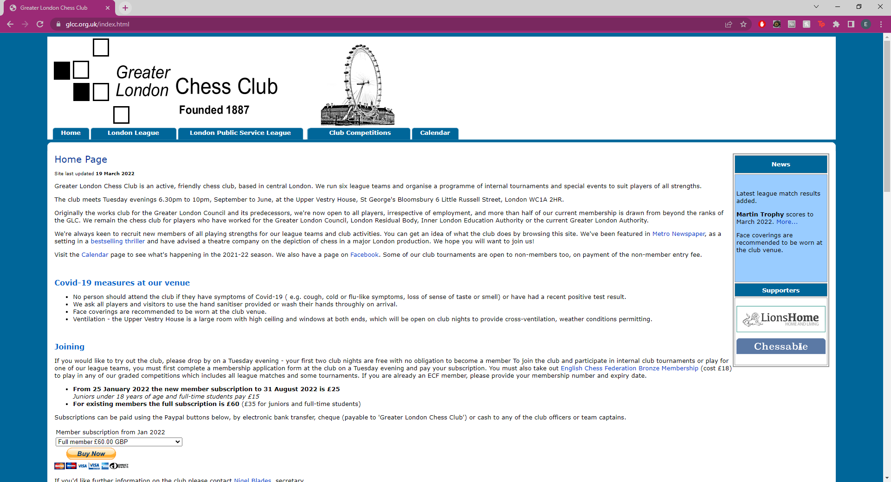
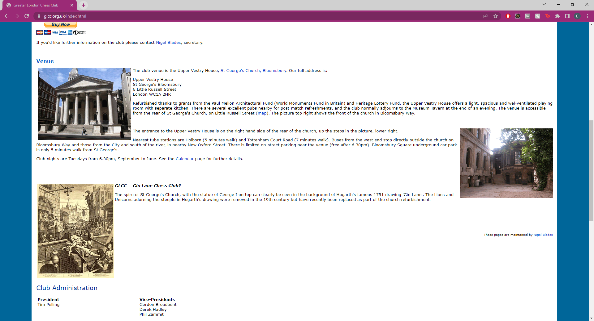
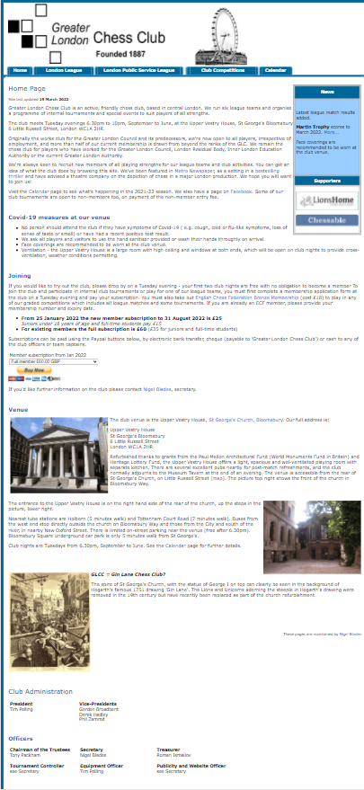

# Competitor Research

As part of my planning, I researched what chess clubs around the world are doing with their own websites regarding design and content.  

## St Louis Chess Club

My first port of call was the [St Louis Chess Club](https://saintlouischessclub.org/) (SLCC), based in MO, USA. SLCC is one of the most famous chess clubs in the world, attracting all-star guest lecturers to their [YouTube channel](https://www.youtube.com/c/STLChessClub) such as International Master Eric Rosen and Grandmaster Benjamin Finegold.  

On opening their website, the user is greeted by a large revolving gallery of photos, showcasing news, products and current events. Immediately below are links to various important sections of the website and a short list of upcoming events, while above is a navbar containing important links. Each link contains a nested menu when hovered over (see below).  

Despite the size of the club and the amount of services they offer, the website does not overwhelm the user, and only the most important information is immediately displayed.  

There is a "contact us" link in the footer of the page, rather than prominently displayed - however, there is a clear CTA to become a member of the club online in the main content. For a larger club, this makes sense as a way to automate the process - however, it may not be as suitable for my project as Kendal Chess Club handles all memberships and fees manually. It may be a feature to consider in future releases.  

The site has a fairly minimalist design with a refined and unobtrusive colour scheme of white and black, with gold accents. It uses a mixture of serif and sans serif fonts to portray a picture of modernity and tradition simultaneously.  

|  |
|:--:|
| A screenshot of the St Louis Chess Club website's home page |

|  |
|:--:|
| A screenshot of the St Louis Chess Club website's home page, scrolled to the bottom |

|  |
|:--:|
| A screenshot of the St Louis Chess Club website's home page, with nested menus showing on the navbar |

|  |
|:--:|
| A screenshot of the St Louis Chess Club website's home page, viewed with a mobile device |

## Greater London Chess Club

The Greater London Chess Club is one of the largest clubs in England - but you may not guess it on your first impressions of their website.

The homepage is cluttered, with a lot of information to digest all at once. That information is useful, including membership info, venue location, meeting times and club administration & contact details, but it is difficult to quickly pick out the sections that you may be interested in.  The layout is single-column and lacks visual interest, and where asides are used they do not align well with the main content.  

When viewed on mobile, the site becomes almost unreadable; while there are elements that are responsively sized, there are no layout breakpoints and text and navigation links become extremely small.  

The colour scheme used is a simple white black and blue, which is simple but uninteresting.  

This site is very much a what-not-to-do guide that looks outdated and unappealing.  

|  |
|:--:|
| A screenshot of the Greater London Chess Club website's home page |

|  |
|:--:|
| A screenshot of the Greater London Chess Club website's home page, showing poorly aligned images |

|  |
|:--:|
| A screenshot of the Greater London Chess Club website's home page, viewed with a mobile device |