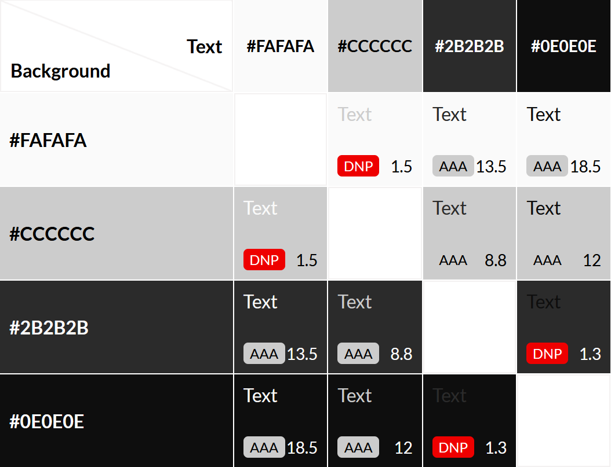

# Kendal Chess Club

# Site Overview

The chess community in Cumbria and the South Lakes is thriving, but poorly designed and rarely updated websites may not reflect this to the uninitiated.  
Especially given the massive uptick in interest in and popularity of chess since the pandemic and the release of The Queen's Gambit on Netflix, local clubs need to be keeping up with current UX and web design principles to attract members, especially of a younger generation.  
This site aims to introduce prospective members to the Kendal Chess Club, offering information about meetings, venues, and contact details, as well as providing relevant information to current members, such as news and events.

# Table of Contents

[to implement]

# Planning Stage

## Stakeholder Interviews  

In order to inform my decisions in the planning stages of this project, I conducted interviews with a number of potential stakeholders and users. These can be found in [INTERVIEWS.md](docs/INTERVIEWS.md)

## Target Audiences

The first stage in planning this project was to identify the stakeholders - those being, the site owner and end users of the site. End users can further be split up into three categories: 
- Users who do not play chess but are interested in starting;
- Users who do play chess and are looking for a club to play with (either after moving to a new location or having played solely online and wanting to experience "over-the-board" chess for the first time);
- Users who are an active member of the club.  

The demographic of these users is extremely broad - anyone from 12-70+ can (and does) attend the club, and members are a mix of men and women. Therefore, the site has to have wide appeal.  

## User Stories

- As someone new to chess, I want to learn the basic rules of the game. 
- As a prospective member, I want to find out when and where the club meets.
- As a prospective member, I want to contact the club organisers.
- As a parent of a young prospective member, I want to know the club's child safety guidelines and policies.
- As a current member, I want to be updated on any club news.
- As a current member, I want to see the status of any ongoing events or competitions.
- As a user, I want to be able to find relevant information quickly and without hassle. 
- As a user, I want to learn about the history of the club.   

## Site Aims

- To provide information on the club and its meetings.
- To allow users to keep up with club news and events.
- To allow users to contact club organisers quickly and easily.
- To educate new players on the rules of chess.
- To showcase the club's history and unique offerings.

## How This Will Be Achieved

- The home page will provide a brief introduction to the club and its meeting times and venue.
- There will be a dedicated news & events page, detailing news from the club and the wider chess world.
- There will be a contact form page where users can provide personal details and a message for the administrators.
    - There will also be details on the club managements' contact details.
- There will be a "how to play" page, which will include the basic rules of chess and other information for beginners.
- There will be a dedicated about us page, which will expand on the introduction on the home page and include some of the club's history.

## Out-of-Scope Features

There are a number of features that would ideally be added to the site but at present are out of scope, either due to knowledge gaps or time restrictions.

In particular, the implementation of a blog or news feed (and an admin login to manage the feed) - this is a big part of the site owner's goals for the site, but without knowledge of backend languages and frameworks (eg. Python and Django), this is currently impossible. However, I can simulate a news feed by creating static content and pages for the purposes of this project.

## Wireframes

In order to organise my thoughts and provide a basic design scheme to work with, I created a number of wireframe diagrams.  

### Mobile wireframes

### Desktop wireframes

## Colour Palette

I took inspiration from the colours of a classic wooden chess set and generated a colour palette that will be used throughout the site for consistency. It is intended to be elegant, understated and modern. I decided to use the off-white #fafafa and off-black #0e0e0e to make the site's appearance less harsh.  
I then ran these colours through [Contrast Grid](https://contrast-grid.eightshapes.com/?version=1.1.0&background-colors=&foreground-colors=%23fafafa%0D%0A%23c48d5a%0D%0A%23875a31%0D%0A%23000000&es-color-form__tile-size=compact&es-color-form__show-contrast=aaa&es-color-form__show-contrast=aa&es-color-form__show-contrast=aa18&es-color-form__show-contrast=dnp) to ensure that the site has sufficient contrast for accessibility.

## Fonts

Taking inspiration from the [St. Louis Chess Club](https://saintlouischessclub.org/), I have decided to use a mixture of serif and sans-serif fonts in my design.  
Headings will use the Merriweather font, while paragraph text will use Merriweather Sans. These two typefaces have been specifically designed to complement each other well.

# Credits

- Screenshots in [COMPETITORS.md](docs/COMPETITORS.md) taken from: 
    - [https://saintlouischessclub.org/](https://saintlouischessclub.org/) 
    - [https://www.glcc.org.uk/](https://www.glcc.org.uk/)
- Colour palette generated with [Coolors](https://coolors.co/?home)
- Fonts sourced from [Google Fonts](https://fonts.google.com/)
- Icons from [Font Awesome](https://fontawesome.com/)
- Special thanks to Jonathan, Fleo, Hana, and Tim for agreeing to be interviewed.