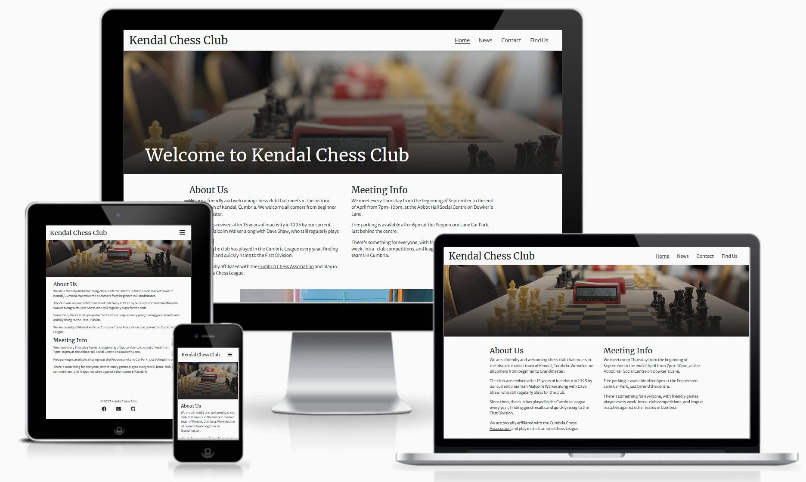
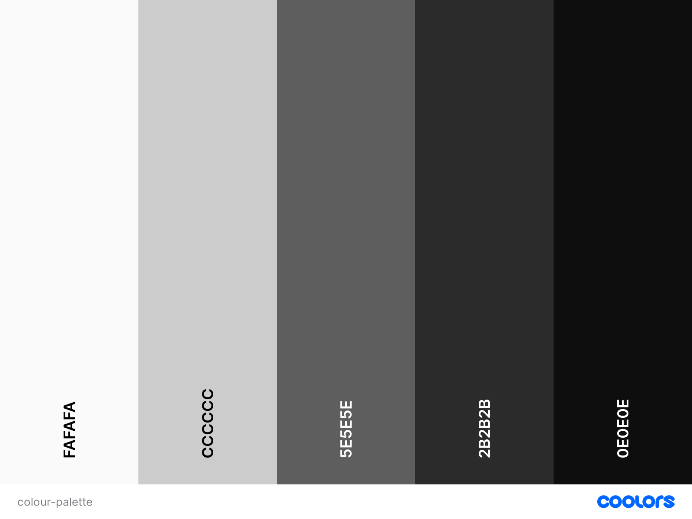
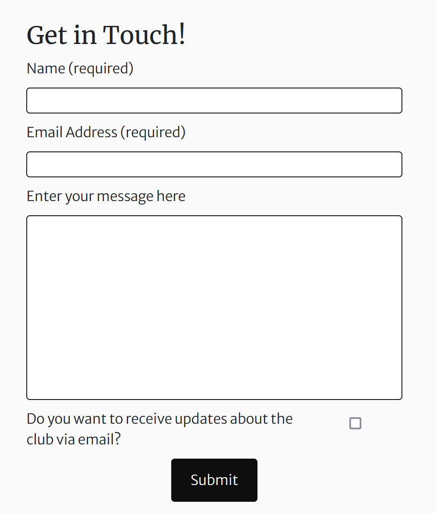

# Kendal Chess Club

# Site Overview

The chess community in Cumbria and the South Lakes is thriving, but poorly designed and rarely updated websites may not reflect this to the uninitiated.  
Especially given the massive uptick in interest in and popularity of chess since the pandemic and the release of The Queen's Gambit on Netflix, local clubs need to be keeping up with current UX and web design principles to attract members, especially of a younger generation.  
This site aims to introduce prospective members to the Kendal Chess Club, offering information about meetings, venues, and contact details, as well as providing relevant information to current members, such as news and events.

# Table of Contents

[to implement]

# Planning Stage

## Stakeholder Interviews  

In order to inform my decisions in the planning stages of this project, I conducted interviews with a number of potential stakeholders and users. These can be found in [INTERVIEWS.md](docs/INTERVIEWS.md)

## Target Audiences

The first stage in planning this project was to identify the stakeholders - those being, the site owner and end users of the site. End users can further be split up into three categories: 
- Users who do not play chess but are interested in starting;
- Users who do play chess and are looking for a club to play with (either after moving to a new location or having played solely online and wanting to experience "over-the-board" chess for the first time);
- Users who are an active member of the club.  

The demographic of these users is extremely broad - anyone from 12-70+ can (and does) attend the club, and members are a mix of men and women. Therefore, the site has to have wide appeal.  

## User Stories

- As someone new to chess, I want to learn the basic rules of the game. 
- As a prospective member, I want to find out when and where the club meets.
- As a prospective member, I want to contact the club organisers.
- As a parent of a young prospective member, I want to know the club's child safety guidelines and policies.
- As a current member, I want to be updated on any club news.
- As a current member, I want to see the status of any ongoing events or competitions.
- As a user, I want to be able to find relevant information quickly and without hassle. 
- As a user, I want to learn about the history of the club.   

## Site Aims

- To provide information on the club and its meetings.
- To allow users to keep up with club news and events.
- To allow users to contact club organisers quickly and easily.
- To educate new players on the rules of chess.
- To showcase the club's history and unique offerings.

## How This Will Be Achieved

- The home page will provide a brief introduction to the club and its meeting times and venue.
- There will be a dedicated news & events page, detailing news from the club and the wider chess world.
- There will be a contact form page where users can provide personal details and a message for the administrators.
    - There will also be details on the club managements' contact details.
- There will be a "how to play" page, which will include the basic rules of chess and other information for beginners.
- There will be a dedicated about us page, which will expand on the introduction on the home page and include some of the club's history.

## Out-of-Scope Features

There are a number of features that would ideally be added to the site but at present are out of scope, either due to knowledge gaps or time restrictions.

In particular, the implementation of a blog or news feed (and an admin login to manage the feed) - this is a big part of the site owner's goals for the site, but without knowledge of backend languages and frameworks (eg. Python and Django), this is currently impossible. However, I can simulate a news feed by creating static content and pages for the purposes of this project.

## Wireframes

In order to organise my thoughts and provide a basic design scheme to work with, I created a number of wireframe diagrams.  

### Mobile wireframes

### Desktop wireframes

## Colour Palette

For the colour palette of my site, I decided to stick with white, black, and greys for a modern, minimalist feel (which also reflects the obvious white/black theme of chess), while relying on hero images to provide a pop of colour. To lessen the harshness of the palette, I used the off-white #FAFAFA and the off-black #0E0E0E.  
I then ran these colours through [Contrast Grid](https://contrast-grid.eightshapes.com/?version=1.1.0&background-colors=&foreground-colors=%23FAFAFA%2C%20Off%20White%0D%0A%23CCCCCC%2C%20Light%20Grey%0D%0A%235E5E5E%2C%20Medium%20Grey%0D%0A%232B2B2B%2C%20Dark%20Grey%0D%0A%230E0E0E%2C%20Off%20Black&es-color-form__tile-size=compact&es-color-form__show-contrast=aaa&es-color-form__show-contrast=aa&es-color-form__show-contrast=aa18&es-color-form__show-contrast=dnp) to ensure that the site has sufficient contrast for accessibility.

## Fonts

Taking inspiration from the [St. Louis Chess Club](https://saintlouischessclub.org/), I have decided to use a mixture of serif and sans-serif fonts in my design.  
Headings will use the Merriweather font, while paragraph text will use Merriweather Sans. These two typefaces have been specifically designed to complement each other well.

# Development Stage

## Deviations from Planning

- After many hours of research, I decided to scrap the idea of a dedicated "about us" page. A lot of the history of the club is unfortunately completely lost, and there simply wasn't enough information to fill a whole page - instead, I expanded on the about section on the home page slightly.

- I largely followed my wireframe diagrams, with a few small changes.
    - I decided to implement a hamburger menu on small screens to save screen real estate.
    - I removed the logo from the header, because I couldn't find an appropriate image to use and don't have the skills to create one myself.
        - For a future release, I may have a logo custom-made.

## Libraries

- The only external library used in this project was [Bootstrap](https://getbootstrap.com/), which I used only to create a dropdown hamburger nav menu, which was impossible to do using only HTML and CSS.
    - Bootstrap also included some basic global styling rules, such as line breaks between \
 tags.

# Site Features

## Header & Navigation

I implemented a sticky header that would remain consistent over all pages. It has 2 styles depending on screen size.  

On large screens, it displays a list of navigation links.  

On smaller screens, the navigation collapses into a hamburger menu to save screen space.  

## Hero Image

Each page has a hero image that adds visual interest and a pop of colour to the otherwise monotone design. I decided to keep the image the same across all pages to maintain consistency.  

A transparency-gradated black overlay is applied to the image so that the white cover text displayed on larger screen sizes can be easily read, and the image position is changed to fixed on large screens for added interest.  

## Footer

Each page has a footer with copyright information, a link to the club's Facebook page, a link to the contact page, and a link to my GitHub. On smaller screens, the information stacks on top of each other while on larger screens it is on the same line.  

The icons for links in the footer were taken from FontAwesome.

## Links

To make external links clear to the user, througout the main body of content all \<a> tags are decorated with an underline and change colour slightly on hover. As links in the header are very clear, only the active page link is underlined, with an underline being added to other links on hover.  

## Page Headings

As the hero image cover text is only displayed on large screens, some pages have a page heading with the same text, displayed only when the cover text is not visible. This ensures that regardless of screen size, the purpose of each page is clear to all users.  

There are cases where this wasn't necessary - for example, the home page already includes section headings and the contact page displays "Get in Touch!" whether the cover text is displayed or not.  

# Page Content

## Home Page

The home page contains some introductory information about the club and a little on its history, as well as information on when and where the club meets. This is the most important information a user would be looking for when visiting the website, so I ensured it was immediately accessible.  

## News Page

The news page contains a list of article previews that link to full articles. The previews contain a relevant image, article title, description, and date of publication.

## Article Pages

The article pages contain the body of the articles previewed on the news page. Some include additional media, like an embedded YouTube video, or links to download supplementary files.  

## Contact Page

The contact page includes a form for users to fill in personal details, add a message, and subscribe to the club's newsletter. The form doesn't function, instead sending a GET request to a feedback page to simulate the functionality.  

The form has input validation, with name and email address being required, and enforcing the email field being in the correct format.  

## Find Us Page

The Find Us page contains details of the club venue's address and reiterates meeting times, as well as displaying an embedded Google Maps frame.  

Google Maps doesn't correctly find the venue, hence the discrepancy between the given address and the address displayed by Google.  

## 404 Page

The 404 page is a very simple page that the user is redirected to when a given page isn't found (eg. an incorrect URL is provided). It informs the user of the error and provides a link to the homepage.

# Credits

- Screenshots in [COMPETITORS.md](docs/COMPETITORS.md) taken from: 
    - [https://saintlouischessclub.org/](https://saintlouischessclub.org/) 
    - [https://www.glcc.org.uk/](https://www.glcc.org.uk/)
- Colour palette generated with [Coolors](https://coolors.co/?home)
- Fonts sourced from [Google Fonts](https://fonts.google.com/)
- Icons from [Font Awesome](https://fontawesome.com/)
- Special thanks to Jonathan and Hana for agreeing to be interviewed.